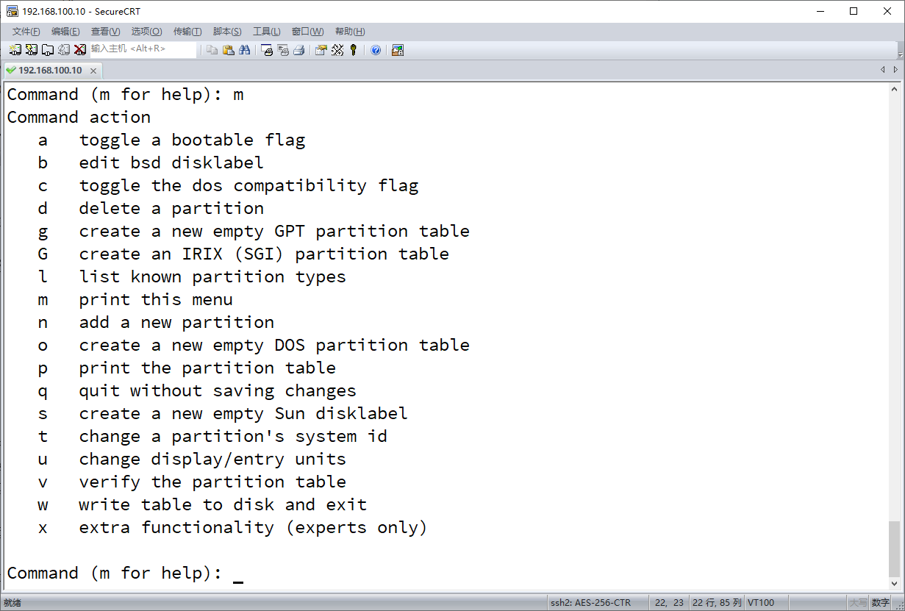

# 不同虚拟机的配置方式

虚拟机软件的选择：VirtualBox6.0及以上；VmwareWorkstation

#### VirtualBox的配置方法：


##### #controller的安装过程： 


1.我们准备好centos7和iaas2.2的iso文件 

2.在一个磁盘空间充足的磁盘下新建两个文件夹VT-controller; VT-compute, 之后的两个节点分别安装在这两个文件夹下 

3.打开VirtualBox--新建--名称：Controller

文件夹：选择之前新建的VT-controller文件夹所在地址

类型：Linux

版本：Other Linux（64bit）

内存：4096MB

虚拟硬盘：现在创建虚拟硬盘

4.文件位置：默认

5.文件大小：40GB

6.虚拟硬盘类型：VDI

7.存储在物理硬盘上：动态分配

此时controller的模板创建好了


1.管理--主机网络管理器--创建（创建两个虚拟网卡）

第一块网卡（手动配置）-- IPV4：192.168.100.1（内网）

 子网掩码：255.255.255.0

DHCP服务器关了

 

第二块网卡（手动配置）-- IPV4：192.168.200.1（外网）

  子网掩码：255.255.255.0

同样关掉DHCP服务

 

2.主页面中--设置--系统（主板）--启动顺序：勾上网络，选中光驱，点边上的”向上“箭头移动到最上方

（处理器）--处理器数量：4

网络（网卡1）--启用网络连接--界面名称：第一网卡

  方式：仅主机--高级--混杂：全部允许

 （网卡2）--界面名称为第二款网卡，其它配置同网卡1相同--OK

 

3.在主页面中，存储--第二IDE控制器主通道（点击选择centos7.ios）

 

4.启动（controller节点已经配置好了）


##### controller节点的安装过程

在centos安装之前，可以在安装界面按“Tab”键

 

 

在原有的内容后面--空格--输入：net.ifnames=0 biosdevname=0

可以禁用网卡命名规则，是的两块网卡（内网和外网）分别为eth0和eth1，方便后面使用，不过后面的内容里，要自觉将ifcfg-enp0s3和ifcfg-enp0s8换成ifcfg-eth0和ifcfg-eth1，即可

 

1.Install Centos7

 

2.Continue（默认英文，千万别选中文，搭建过程中会乱码和报错，之后也不会安装图形化界面，因为没必要）--SYSTEM选项中的（installtion  destination）--other storage options选项中：选中I will configure partioning

 

3.Done--Click here to create them automatically（若有/home目录，选中点击下面的‘—’号，可以删除，因为不需要）

 

4.Done--Accept Changes

 

5.Begin Installation

 

6.此时在安装过程中可以设置Root用户的密码，密码：000000，因为方便；其它的不管

 

7.reboot完成controller的安装

 

##### compute的安装过程：


1.新建--名称：Compute

文件夹：选择之前新建的VT-controller文件夹所在地址

类型：Linux

版本：Other Linux（64bit）

内存：2048MB

虚拟硬盘：现在创建虚拟硬盘

4.文件位置：默认

5.文件大小：40GB

6.虚拟硬盘类型：VDI

7.存储在物理硬盘上：动态分配

此时compute的模板创建好了


1.主页面中--设置--系统（主板）--启动顺序：勾上网络，选中光驱，点边上的”向上“箭头移动到最上方

（处理器）--处理器数量：2

网络（网卡1）--启用网络连接--界面名称：第一网卡

  方式：仅主机--高级--混杂：全部允许

 （网卡2）--界面名称为第二款网卡，其它配置同网卡1相同--OK

 

2.在主页面中，存储--第二IDE控制器主通道（点击选择centos7.ios）

 

3.启动（compute节点已经配置好了）

 

##### controller节点的安装过程


就照着上面controller节点的安装过程一样的步骤来

至此两个节点都安装完毕！！！

接着要对compute节点再照护一下，先将compute节点关机再操作


compute节点的磁盘分区（parted和fdisk两种方法，推荐用parted）

 

1.在主页面中--（选中）compute节点--设置--存储--（存储介质：控制器IDE）最右边有个鼠标移上去会显示“添加虚拟硬盘”并点击--创建新的虚拟盘--文件大小：20GB--虚拟硬盘文件类型VDI--创建--OK

2.开启compute节点（要对新添加的虚拟硬盘进行配置）

##### 3.在compute中：（parted）

```
\# fdisk -l

可以看到Disk /dev/sdb

\# parted /dev/sdb 

\#p

\#h
```

4.可以看到如图的内容： 


##### 5.我们需要分别进行mklabel和mkpart

```
\#mklable gpt

\#mkpart cinder

\#xfs

\#0

\#8G

\#I

\#p
```

 

6.此时可以看到已经分好了一个8G的分区cinder


 

7.同理


```
\#q（退出）
```

此时swift的盘也分好了

cinder和swift的盘分别对应这sdb1和sdb2，后面的IaaS搭建里的openrc配置里会用上

 

##### 8.fdisk的分区方法：


sdb1的创建方式：  


```
\#fdisk /dev/sdb 

\#m
```


可以看到帮助文档




其中n为添加一个新的分区，w为分好后保存，退出（如果没有w，直接退出，就等于没分区）

 

前几个都是默认即可，回车

一直到 Last sector, +sectors or +size{K,M,G} (2048-41943039, default 41943039): +8G

+size{K,M,G} 其中，+size是你要划分的大小数值，{K,M,G}里的三个为可选的单位，我们这里仅为演示所以我是+8G

\#w （保存，退出）

此时一个分区创建好了（sdb1）

 

sdb2的创建方式如下：


```
\#fdisk -l
```

 

可以看到两个都创建好了 


这里关于compute节点的磁盘分区就到这了！

 

接着在compute节点中：

```
\#parted /dev/sd*

（可以看到其中有sda, sda1, sda2, sdb, sdb1, sdc, sdc1；其中sdb1,sdb2分别为后面要配置的cinder和swift两个云盘）
```

 

以上就是VirtualBox的配置方法

 

接下来就是VmwareWorkstation的配置方式

 

首先在主页面的上菜单栏中--编辑--虚拟网络编辑器--(VmwareWorkstation自己默认有一个VMnet0)--添加网络（添加两个，分别为VM net1，VMnet2）--选中VMnet1--在VMnet信息中选中‘仅主机模式’--选中‘将主机虚拟适配器连接到此网络’，取消使用本地DHCP--子网IP：192.168.100.0--子网掩码：255.255.255.0（内网）

选中VMnet2--在VMnet信息中选中‘NAT模式’--选中‘将主机虚拟适配器连接到此网络’，取消使用本地DHCP--子网IP：192.168.200.0--子网掩码：255.255.255.0（外网）

 

网卡配置好了，接下来是两个控制节点

 

#### controller的安装过程： 

1.我们准备好centos7和iaas2.2的iso文件 

2.在一个磁盘空间充足的磁盘下新建两个文件夹VM-controller; VM-compute, 之后的两个节点分别安装在这两个文件夹下

3.在主页面中--创建新的虚拟机--典型--下一步--稍后安装操作系统--下一步：客户机操作系统：Linux--下一步

 版本：centos7 64位

4.虚拟机名称：Controller

 位置：你所创建的VM-controller文件夹的地址--下一步

 最大磁盘大小：40GB

 选中：将虚拟磁盘拆分成多个文件--下一步--自定义硬件：内存：4GB

  处理器数量和内核都选：2；虚拟化引擎：选中‘虚拟化 InterVT-x/EPT或AMD-V/RVI ’

  选中‘新CD/DVD（IDE）’：添加一个新的‘新CD/DVD（IDE）’

  （两个IDE的设备状态选中启动时连接，连接选中使用ISO映像文件）

  

  浏览：centos7.iso文件的地址，第二个IDE选中iaas2.2.iso文件地址

  

   选中‘网络适配器’：添加一个新的‘网络适配器2’

（两个网络适配器，第一个：仅主机模式；第二个：默认NAT模式）--关闭--完成


5.鼠标移到创建好的controller节点上--右击--管理--克隆--下一步--下一步--创建方法：链接克隆--下一步--虚拟机名称：Compute

位置--浏览：VM-compute文件夹位置

--完成--关闭

 

6.编辑虚拟机--内存：2

处理器数量和内核都选：1；虚拟化引擎：选中‘虚拟化 InterVT-x/EPT或AMD-V/RVI ’

（其它不用动）

两个节点的配置完成，安装过程和VirtualBox的安装过程一样

接下来就是VmwareWorkstation中compute节点的添加磁盘了

选中compute节点--编辑虚拟机设置--硬盘--添加（硬盘，添加两个）--下一步--默认推荐--创建新虚拟硬盘--磁盘大小：20GB--将虚拟硬盘拆分成多个文件--下一步--完成

（第二块硬盘的文件名不可与第一块硬盘文件名相同，随别改一个）

现在启动compute节点，接下来的步骤和VirtualBox的磁盘配置方法相同

至此，两个不同虚拟机软件对两个不同节点的配置和磁盘划分的方法介绍完毕！！！

 

请看下一篇secureCRTP连接虚拟机！！！