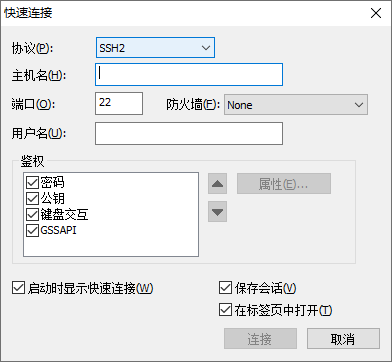
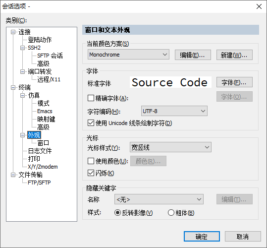

# secureCRT连接虚拟机

本文介绍使用secureCRTP连接虚拟机，因为secureCRTP使用方便，观感也很好，还可以定制字体和字号，支持复制粘贴功能和上传镜像功能，这些功能在后面IAAS搭建里十分好用

 

虚拟机要想能通过CRT连接，就必须要将虚拟机的网络环境配置好，也是IAAS搭建的基本要求条件

 

centos7的网络配置文件在 /etc/sysconfig/network-scripts/下

 

controller和compute两个节点的配置方法基本相同，首先介绍controller的配置方式

 

[root@controller ~]#

#### #controller的网络配置

 

| 1.#cd  /etc/sysconfig/network-scripts/ | （将工作台切换到该目录下）           |
| -------------------------------------- | ------------------------------------ |
| 2.#ls  ifcfg-enp*                      | （查看所有以ifcfg-enp*  开头的文件） |

此时应该可以看到两个文件，如果不是两个，说明你之前的虚拟机网卡配置错了

 

以本人的为例，出现了ifcfg-enp0s3和ifcfg-enp0s8两个文件，也就是两个网卡配置文件

此处，我们以ifcfg-enp0s3为内网，ifcfg-enp0s8为外网，进行配置，至于为什么，上一篇有提示过

 

3.#vi ifcfg-enp0s3

 

按照我这样配置：（按‘i’进行修改，按‘Esc’退出修改，按‘shift’加‘x’保存退出，后面经常用，不过多阐述；如果后面如果输错文件名，退出修改后按‘shift’+‘q！’，不保存退出文件）

TYPE=Ethernet

| BOOTPROTO=static | （此处修改） |
| ---------------- | ------------ |
|                  |              |

DEFROUTE=yes

PEERDNS=yes

PEERROUTES=yes

IPV4_FAILURE_FATAL=no

IPV6INIT=yes

IPV6_AUTOCONF=yes

IPV6_DEFROUTE=yes

IPV6_PEERDNS=yes

IPV6_PEERROUTES=yes

IPV6_FAILURE_FATAL=no

NAME=enp0s3

UUID=e0c0cc4d-0233-4f43-b71e-8b18920330cb

DEVICE=enp0s3

| ONBOOT=yes            | （此处修改）   |
| --------------------- | -------------- |
| IPADDR=192.168.100.10 | （此处为添加） |
| GATEWAY=192.168.100.1 | （此处为添加） |
| NETMASK=255.255.255.0 | （此处为添加） |

保存，退出

 

4.#vi ifcfg-enp0s8

 

分别将：

| BOOTPROTO=static      | （此处修改）   |
| --------------------- | -------------- |
| ONBOOT=yes            | （此处修改）   |
| IPADDR=192.168.200.10 | （此处为添加） |
| NETMASK=255.255.255.0 | （此处为添加） |

注意：外网不添加GATEWAY这一项

保存，退出

 

| 5.#cd                       | （将工作台切换到根目录下）                                   |
| --------------------------- | ------------------------------------------------------------ |
| 6.#service  network restart | （重新启动网卡，如果出现：Restarting network (via systemctl): [   OK ]，说明配置完成） |

 

 

#### #compute的网络配置

 

[root@compute ~]#

 

方法同controller一样，此处只提出不同的地方

 

1.#vi ifcfg-enp0s3

 

| BOOTPROTO=static      | （此处修改）   |
| --------------------- | -------------- |
| ONBOOT=yes            | （此处修改）   |
| IPADDR=192.168.100.20 | （此处为添加） |
| NETMASK=255.255.255.0 | （此处为添加） |
| GATEWAY=192.168.100.1 | （此处为添加） |

保存，退出

 

2.#vi ifcfg-enp0s8

 

| BOOTPROTO=static      | （此处修改）   |
| --------------------- | -------------- |
| ONBOOT=yes            | （此处修改）   |
| IPADDR=192.168.200.20 | （此处为添加） |
| NETMASK=255.255.255.0 | （此处为添加） |

保存，退出

 

3.#cd

 

4.#service network restart

 

至此controller和compute的两个节点的网络配置完毕，此时可以使用CRT进行连接使用了

 

secureCRTP的连接：

 

1.首先打开CRT，进行controller的连接

 

2.文件--快速连接（出现如下窗口）

3.主机名：192.168.100.10

  用户名：root

  连接--输入密码：000000--保存密码--确定

  （此时已经连上controller的虚拟机）

 

4.鼠标右击192.168.100.10的标签--会话选项

本人的配置方法如下（个人觉的比较好看）

compute的连接过程和controller相同

主机名：192.168.100.20

（其他都一样好了）

 

 

至此用secureCRTP连接虚拟机的内容介绍完毕，接下来就是进入正题了

 

请看下一篇secureCRTP上传镜像！！！

