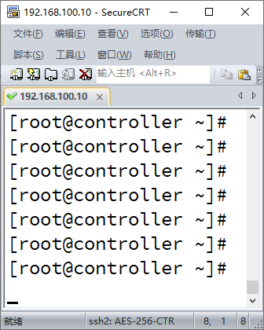
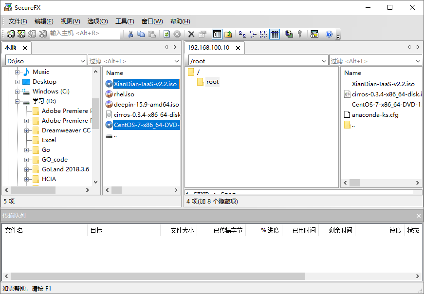

# secureCRT上传镜像

本文为如何在secureCRT中往虚拟机中上传镜像文件

 

打开secureCRT后

 

#### 1.

将鼠标移到192.168.100.10的标签，右击--打开secureFX

#### 2.

选中本地里的XianDian-Iaas-v2.2.iso和CentOS-7-x86_64-DVD-1511.iso文件，右击--上传（直接确定默认的选项即可）

本人这里已经上传好了（上传到root目录下，如上图所示）

 

注：此处还可以额外从本地上传如上图中的  cirros-0.3.4-x86_64-disk.img ,因为XianDian和CentOS的镜像较大，后期建立云主机电脑内存不够可能会创建失败，该额外提供的镜像非常小，后期创建云主机时如果电脑内存足够大，可以用CentOS的镜像，如果不够，就用这个小镜像

 

至此，secureCRT上传镜像文件的方法介绍完了，搭建IAAS时会用上这个！！！

 

请看下一篇IAAS搭建！！！