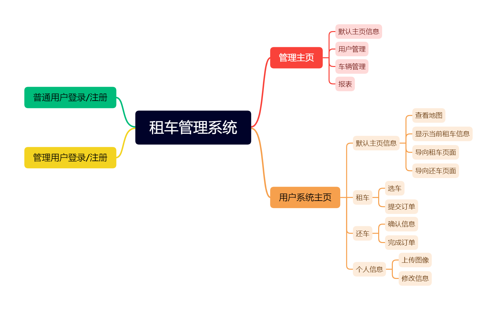
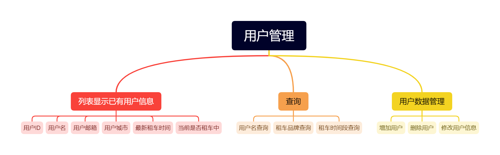
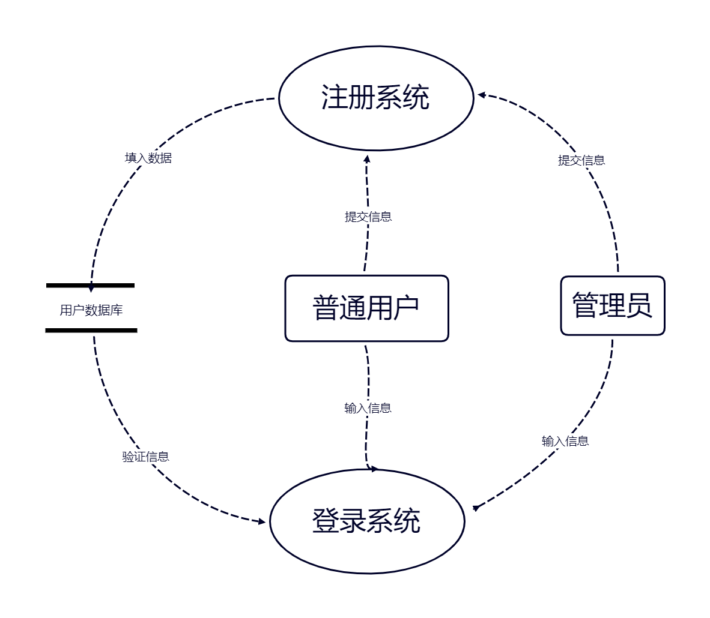
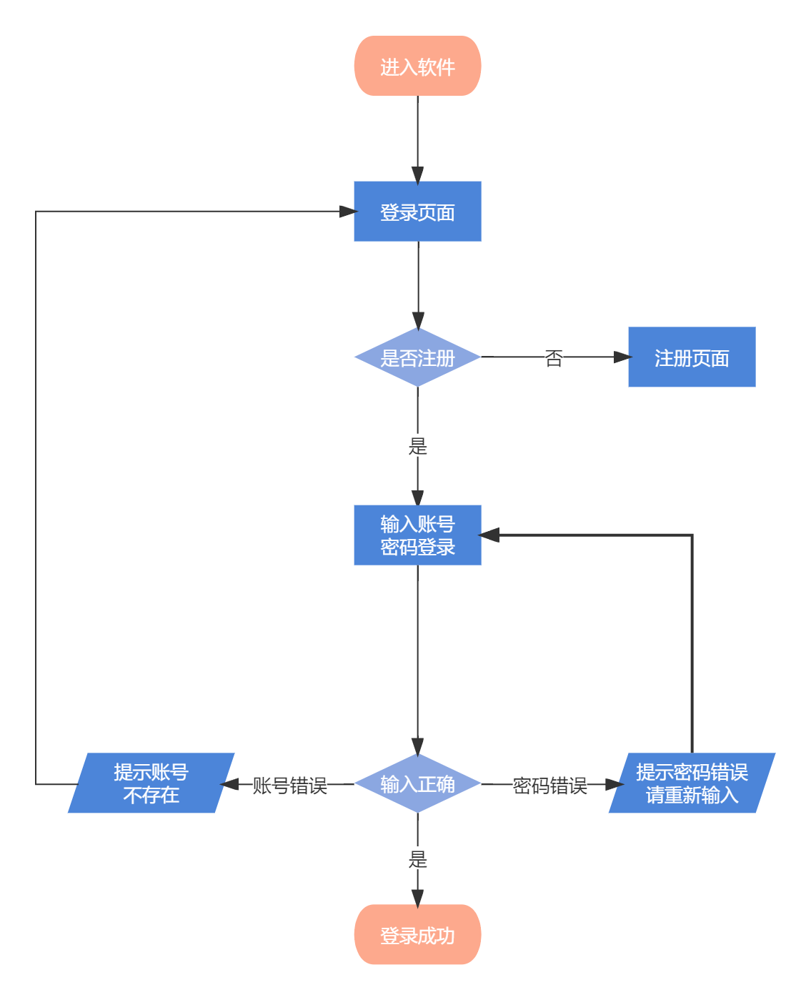
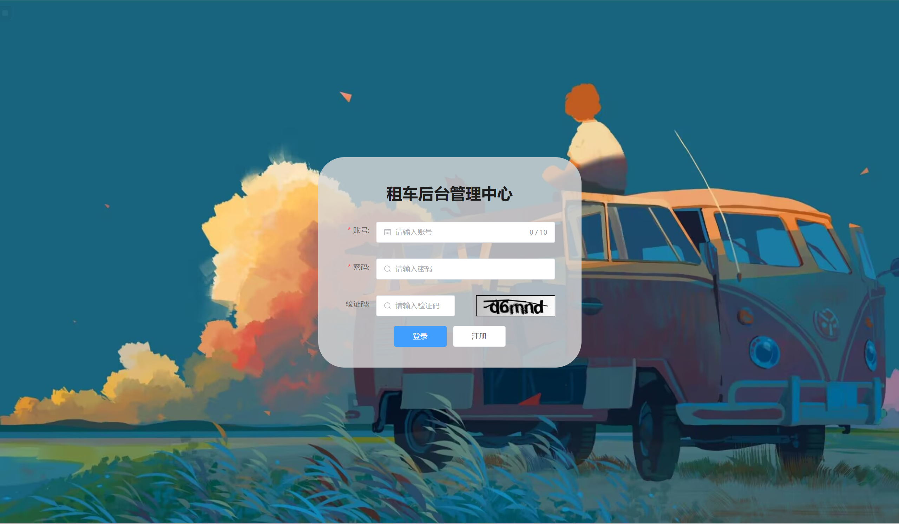
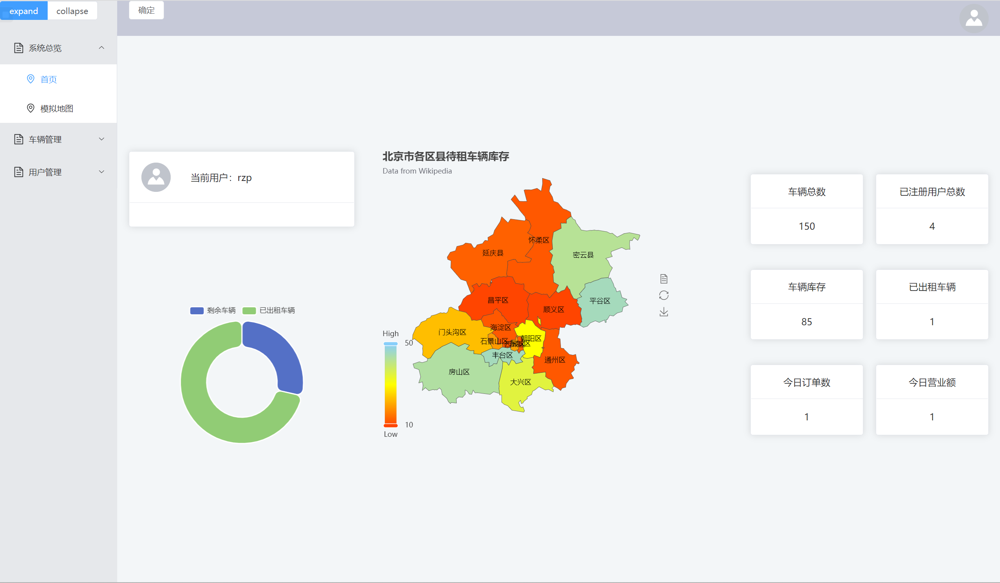
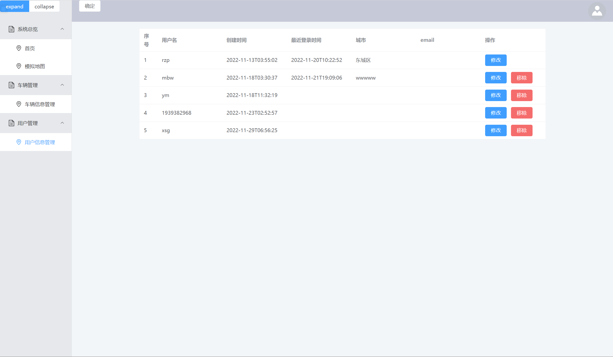
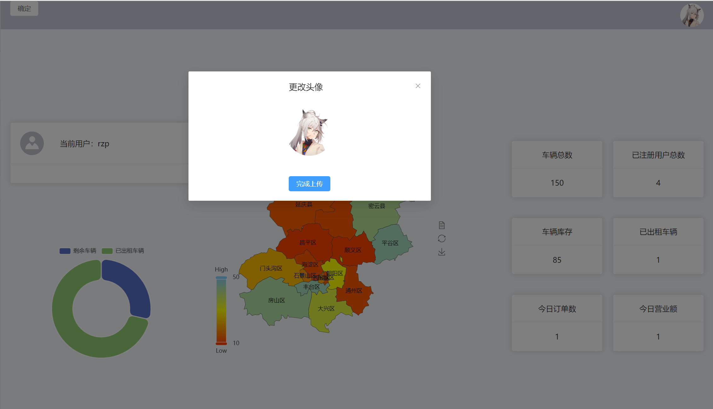
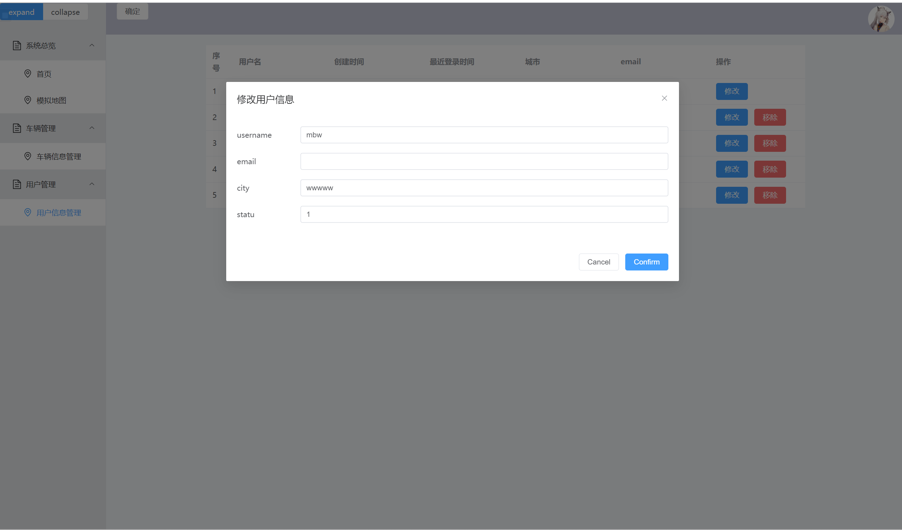
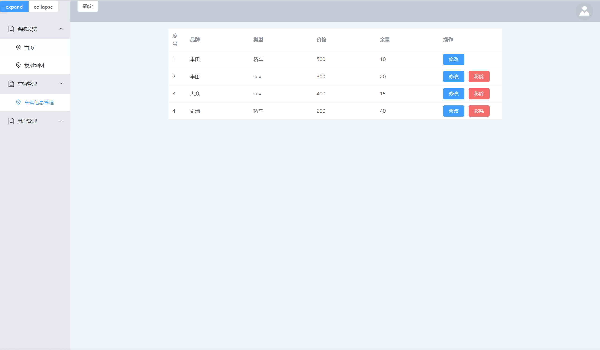

# 租车管理项目分析


[租车管理网站](http://106.14.122.136:9090/#/main/mainIndex)

登录账号：rzp

密码：520


>功能图
>数据流图
>程序流程图
>数据库设计
>前端
>后端
>jar发布
>单元测试
>压力测试


[toc]


### 1. 功能图

#### 租车管理系统




#### 用户管理




### 2. 数据流图

#### 2.1 登录/注册




### 3. 程序流程图

#### 3.1 登录/注册




### 4. 数据库设计

:::danger

:::


### 5. 前端设计


设计工具：

- VsCode

- Vue3
- ElementUI
- Axios
- WebPack
- JavaScript


#### 5.1 前端页面


##### 5.1.1 登录/注册页面




##### 5.1.2 主页面




##### 5.1.3 用户管理页面




##### 5.1.4 用户头像上传




##### 5.1.5 用户信息修改




##### 5.1.6 车辆信息页面




### 6. 后端设计


#### 6.1 设计工具

设计工具：

- IDEA

- SpringBoot
- Java
- Redies
- MySQL
- SpringSecurity
- MybatiesPlus
- GoogleKaptcha
- jwt


#### 6.2 项目结构

项目结构：

RentCar

- src
  - main
    - java
      - config
      - controller
      - Exception
      - filter
      - handler
      - mapper
      - projo
      - rentcar
      - service
      - utils
      - vaild
      - Vo
      - RentcarApplication.java
    - resource
  - test
    - RentcarApplicationTests.java


#### 6.3 代码-Config


##### 6.3.1 跨域配置

**CorsConfig.java**

```java
package com.xiao.config;

import org.springframework.context.annotation.Bean;
import org.springframework.context.annotation.Configuration;
import org.springframework.web.cors.CorsConfiguration;
import org.springframework.web.cors.UrlBasedCorsConfigurationSource;
import org.springframework.web.filter.CorsFilter;
import org.springframework.web.servlet.config.annotation.CorsRegistry;
import org.springframework.web.servlet.config.annotation.WebMvcConfigurer;

@Configuration
public class CorsConfig implements WebMvcConfigurer {

private CorsConfiguration buildConfig() {
    CorsConfiguration corsConfiguration = new CorsConfiguration();
    corsConfiguration.addAllowedOrigin("*");
    corsConfiguration.addAllowedHeader("*");
    corsConfiguration.addAllowedMethod("*");
    corsConfiguration.addExposedHeader("Authorization");
    return corsConfiguration;
}

    @Bean
    public CorsFilter corsFilter() {
        UrlBasedCorsConfigurationSource source = new UrlBasedCorsConfigurationSource();
        source.registerCorsConfiguration("/**", buildConfig());
        return new CorsFilter(source);
    }

    @Override
    public void addCorsMappings(CorsRegistry registry) {
        registry.addMapping("/**")
                .allowedOrigins("*")
                .allowedMethods("GET", "POST", "DELETE", "PUT")
                .maxAge(3600);
    }
}
```


##### 6.3.2 全局异常处理

**GlobalExceptionHadler.java**

```java
package com.xiao.config;


import com.xiao.utils.Result;
import lombok.extern.slf4j.Slf4j;
import org.springframework.http.HttpStatus;
import org.springframework.validation.BindingResult;
import org.springframework.validation.ObjectError;
import org.springframework.web.bind.MethodArgumentNotValidException;
import org.springframework.web.bind.annotation.ExceptionHandler;
import org.springframework.web.bind.annotation.ResponseStatus;
import org.springframework.web.bind.annotation.RestControllerAdvice;

@Slf4j
@RestControllerAdvice
public class GlobalExceptionHadler {

    // 实体校验异常捕获
    @ResponseStatus(HttpStatus.BAD_REQUEST)
    @ExceptionHandler(value = MethodArgumentNotValidException.class)
    public Result handler(MethodArgumentNotValidException e) {
        BindingResult result = e.getBindingResult();
        ObjectError objectError = result.getAllErrors().stream().findFirst().get();
        log.error("实体校验异常：----------------{}", objectError.getDefaultMessage());
        return Result.fail(objectError.getDefaultMessage());
    }

    @ResponseStatus(HttpStatus.BAD_REQUEST)
    @ExceptionHandler(value = IllegalArgumentException.class)
    public Result handler(IllegalArgumentException e) {
        log.error("Assert异常：----------------{}", e.getMessage());
        return Result.fail(e.getMessage());
    }

    @ResponseStatus(HttpStatus.BAD_REQUEST)
    @ExceptionHandler(value = RuntimeException.class)
    public Result handler(RuntimeException e) {
        log.error("运行时异常：----------------{}", e.getMessage());
        return Result.fail(e.getMessage());
    }
}
```


##### 6.3.3 Redies序列化配置

**RedisConfig.java**

```java
package com.xiao.config;

import com.fasterxml.jackson.databind.ObjectMapper;
import org.springframework.context.annotation.Bean;
import org.springframework.context.annotation.Configuration;
import org.springframework.data.redis.connection.RedisConnectionFactory;
import org.springframework.data.redis.core.RedisTemplate;
import org.springframework.data.redis.serializer.Jackson2JsonRedisSerializer;
import org.springframework.data.redis.serializer.StringRedisSerializer;
import org.springframework.context.annotation.Bean;
import org.springframework.context.annotation.Configuration;

@Configuration
public  class RedisConfig {
    @Bean
    RedisTemplate redisTemplate(RedisConnectionFactory redisConnectionFactory) {

        RedisTemplate redisTemplate = new RedisTemplate();
        redisTemplate.setConnectionFactory(redisConnectionFactory);

        Jackson2JsonRedisSerializer jackson2JsonRedisSerializer = new Jackson2JsonRedisSerializer(Object.class);
        jackson2JsonRedisSerializer.setObjectMapper(new ObjectMapper());

        redisTemplate.setKeySerializer(new StringRedisSerializer());
        redisTemplate.setValueSerializer(jackson2JsonRedisSerializer);

        redisTemplate.setHashKeySerializer(new StringRedisSerializer());
        redisTemplate.setHashValueSerializer(jackson2JsonRedisSerializer);

        return redisTemplate;
    }
}
```


##### 6.3.4 接口放行和权限控制配置

**securityConfig.java**

```java
package com.xiao.config;

import com.xiao.filter.jwtFilter;
import com.xiao.handler.AccessDeniedHandlerImpl;
import com.xiao.handler.AuthenticationEntryPointImpl;
import com.xiao.handler.LoginFailHadler;
import org.springframework.beans.factory.annotation.Autowired;
import org.springframework.context.annotation.Bean;
import org.springframework.context.annotation.Configuration;
import org.springframework.security.authentication.AuthenticationManager;
import org.springframework.security.config.annotation.web.builders.HttpSecurity;
import org.springframework.security.config.annotation.web.configuration.EnableWebSecurity;
import org.springframework.security.config.annotation.web.configuration.WebSecurityConfigurerAdapter;
import org.springframework.security.config.http.SessionCreationPolicy;
import org.springframework.security.crypto.bcrypt.BCryptPasswordEncoder;
import org.springframework.security.crypto.password.PasswordEncoder;
import org.springframework.security.web.authentication.UsernamePasswordAuthenticationFilter;


@Configuration
@EnableWebSecurity
public class securityConfig extends WebSecurityConfigurerAdapter {
    @Autowired
    LoginFailHadler loginFailHadlerl;
    @Autowired
    jwtFilter jwtFilter;
    @Autowired
    AuthenticationEntryPointImpl authenticationEntryPoint;
    @Autowired
    AccessDeniedHandlerImpl accessDeniedHandler;


    @Bean
    public PasswordEncoder passwordEncoder(){
        return new BCryptPasswordEncoder();
    }

    @Bean
    @Override
    protected AuthenticationManager authenticationManager() throws Exception {
        return super.authenticationManager();
    }

    @Override
    protected void configure(HttpSecurity http) throws Exception {
             http
				.formLogin()
                .failureHandler(loginFailHadlerl);
                http.cors()
                .and()
                //关闭csrf
                .csrf().disable()
                //不通过Session获取SecurityContext
                .sessionManagement().sessionCreationPolicy(SessionCreationPolicy.STATELESS)
                .and()
                .authorizeRequests()
                // 对于登录接口 允许匿名访问
                .antMatchers("/sys/user/login","/captcha","/sys/user/register","/swagger-ui.html","/webjars/**",
                "/swagger-resources/**","/Javaimage","/v2/**"
                ).anonymous()
                // 除上面外的所有请求全部需要鉴权认证
                .anyRequest().authenticated();
                 http.addFilterBefore(jwtFilter, UsernamePasswordAuthenticationFilter.class);

        //配置异常处理器
        http.exceptionHandling()
                //配置认证失败处理器
                .authenticationEntryPoint(authenticationEntryPoint)
                .accessDeniedHandler(accessDeniedHandler);
    }
}
```


##### 6.3.5 验证码配置

**YanZhengMaConfig.java**

```java
package com.xiao.config;

import com.google.code.kaptcha.impl.DefaultKaptcha;
import com.google.code.kaptcha.util.Config;
import org.springframework.context.annotation.Bean;
import org.springframework.context.annotation.Configuration;

import java.util.Properties;

@Configuration
public class YanZhengMaConfig {

    @Bean
    DefaultKaptcha producer() {
        Properties properties = new Properties();
        properties.put("YanZhengMa.border", "no");
        properties.put("YanZhengMa.textproducer.font.color", "red");
        properties.put("YanZhengMa.textproducer.char.space", "4");
        properties.put("YanZhengMa.image.height", "50");
        properties.put("YanZhengMa.image.width", "130");
        properties.put("YanZhengMa.textproducer.font.size", "40");

        Config config = new Config(properties);
        DefaultKaptcha defaultKaptcha = new DefaultKaptcha();
        defaultKaptcha.setConfig(config);

        return defaultKaptcha;
    }
}
```


#### 6.4 代码-Controller


##### 6.4.1 系统用户控制

**SysUserController.java**

```java
package com.xiao.controller;

import cn.hutool.core.util.StrUtil;
import com.baomidou.mybatisplus.core.conditions.query.QueryWrapper;
import com.baomidou.mybatisplus.extension.plugins.pagination.Page;
import com.xiao.projo.SysUser;
import com.xiao.projo.SysUserRole;
import com.xiao.service.ISysUserService;
import com.xiao.utils.GlobalConst;
import com.xiao.utils.Result;
import com.xiao.valid.AddGroup;
import org.springframework.beans.factory.annotation.Autowired;
import org.springframework.security.authentication.UsernamePasswordAuthenticationToken;
import org.springframework.security.core.Authentication;
import org.springframework.security.core.context.SecurityContextHolder;
import org.springframework.security.crypto.bcrypt.BCryptPasswordEncoder;
import org.springframework.transaction.annotation.Transactional;
import org.springframework.validation.annotation.Validated;
import org.springframework.web.bind.annotation.*;

import java.security.Principal;
import java.time.LocalDateTime;
import java.util.Arrays;
import java.util.HashMap;
import java.util.List;
import java.util.Map;

/**
 * <p>
 *  前端控制器
 * </p>
 *
 * @author rzp
 * @since 2022-10-15
 */
@RestController
@RequestMapping("/sys/user")
public class SysUserController extends BaseController{
    @Autowired
    ISysUserService sysUserService;
    @Autowired
    BCryptPasswordEncoder passwordEncoder;

    @PostMapping("/login")
    public Result Login(@Validated @RequestBody  SysUser user){
      return sysUserService.login(user);
    }

    @GetMapping("/out")
    public  Result out(){
        return sysUserService.out();
    }

    @PostMapping("/register")
    public  Result register(@RequestBody  SysUser user){
        return  sysUserService.register(user);

    }
    @CrossOrigin

    @GetMapping("/info")
    public Result info(){
       List<SysUser> sysUsers= sysUserService.getInfo();
        Map<String,Object> map=new HashMap<>();
        int size=0;
        if (sysUsers.size()>0){
           size= sysUsers.size()-1;
        }
        Authentication authentication = SecurityContextHolder.getContext().getAuthentication();
        String username = (String) authentication.getPrincipal();
        map.put("CurrentUser",username);
        map.put("registerUserNum",size);
        map.put("userInfo",sysUsers);
        return Result.success(200,"success",map);

    }

    @GetMapping("/list")
    public Result list(String username) {
        Page<SysUser> pageDate = sysUserService.page(getPage(),
                new QueryWrapper<SysUser>().
                        like(StrUtil.isNotBlank(username), "username", username));
        return Result.success(pageDate);

    }

    @PostMapping("/save")
    public Result save(@Validated({AddGroup.class}) @RequestBody SysUser sysUser){
        sysUser.setCreated(LocalDateTime.now());
        sysUser.setStatu(GlobalConst.STATUS_ON);
        //默认密码
        String encode = passwordEncoder.encode(GlobalConst.DEFULT_PASSWORD);
        sysUser.setPassword(encode);
        //默认头像

        sysUserService.save(sysUser);
        return Result.success(sysUser);
    }
    @PostMapping("/update")
    public Result update(@Validated @RequestBody SysUser sysUser){
        sysUser.setUpdated(LocalDateTime.now());
        sysUserService.updateById(sysUser);
        return Result.success(sysUser);

    }
    //两次查库需要同时成功 添加事物
    @Transactional
    @PostMapping("/delete")
    public Result delete(@RequestBody Long[] ids){
        sysUserService.removeByIds(Arrays.asList(ids));
        //删除中间表

        sysUserRoleService.remove(new QueryWrapper<SysUserRole>().in("user_id",ids));
        return Result.success("");

    }
}
```


##### 6.4.2 验证码控制

**YanZhengMaController.java**

```java
package com.xiao.controller;

import cn.hutool.core.codec.Base64Encoder;
import cn.hutool.core.map.MapUtil;
import com.google.code.kaptcha.Producer;
import com.xiao.utils.GlobalConst;
import com.xiao.utils.RedisUtil;
import com.xiao.utils.Result;
import org.springframework.beans.factory.annotation.Autowired;
import org.springframework.data.redis.core.RedisTemplate;
import org.springframework.data.redis.core.StringRedisTemplate;
import org.springframework.web.bind.annotation.CrossOrigin;
import org.springframework.web.bind.annotation.GetMapping;
import org.springframework.web.bind.annotation.RestController;
import javax.imageio.ImageIO;
import java.awt.image.BufferedImage;
import java.io.ByteArrayOutputStream;
import java.io.IOException;
import java.util.UUID;

@RestController
public class YanZhengMaController extends BaseController{
    @Autowired
    RedisTemplate redisTemplate;

    @Autowired
    StringRedisTemplate stringRedisTemplate;

    @Autowired
    RedisUtil redisUtil;

    @Autowired
    Producer producer;
    
    @CrossOrigin
    @GetMapping("/captcha")
    public Result Captcha() throws IOException {
        //生成key 和code

        String uuid= UUID.randomUUID().toString().replace("_","");
        String code=producer.createText();    //生成5位数验证码

        BufferedImage image=producer.createImage(code);//生成图片

        ByteArrayOutputStream outputStream=new ByteArrayOutputStream(); //通过输出流
        ImageIO.write(image,"jpg",outputStream);

        //把流转换为64
        String str="data:image/jepg;base64,";
        String base64Img=str+Base64Encoder.encode(outputStream.toByteArray());

        redisUtil.hset(GlobalConst.YANZHENGMA_KEY,uuid,code,240);
        return Result.success(MapUtil.builder().put("uuid",uuid)
                                               .put("captchaImg",base64Img).build());
    }
}
```


##### 6.4.3 系统菜单控制

**SysMenuController.java**

```java
package com.xiao.controller;


import cn.hutool.core.map.MapUtil;

import com.xiao.Vo.NavVo;
import com.xiao.projo.SysUser;
import com.xiao.utils.Result;

import org.springframework.util.StringUtils;
import org.springframework.web.bind.annotation.GetMapping;
import org.springframework.web.bind.annotation.RequestMapping;

import org.springframework.web.bind.annotation.RestController;

import java.security.Principal;

import java.util.List;

/**
 * <p>
 *  前端控制器
 * </p>
 *
 * @author rzp
 * @since 2022-10-20
 */
@RestController
@RequestMapping("/sys/menu")
public class SysMenuController extends BaseController{

    @GetMapping("/nav")
    public Result nav(Principal principal){
        String name = principal.getName();
        System.out.println("name:"+name);

        SysUser sysUser = sysUserService.getByUsername(name);

        Long id = sysUser.getId();
        //获取权限信息
        String authorities= sysUserService.getAuthorities(id);


        String[] strings = StringUtils.tokenizeToStringArray(authorities, ",");
        //获取导航栏信息
        List<NavVo> navVos=sysMenuService.getUserNavs();

        return Result.success(MapUtil.builder().put("Authorities",strings)
                .put("nav",navVos).map()
        );
    }
}
```


##### 6.4.4 系统车辆控制

**SysCarController.java**

```java
package com.xiao.controller;

import com.xiao.Vo.orderVo;
import com.xiao.projo.SysCar;
import com.xiao.projo.SysOrder;
import com.xiao.service.ISysCarService;
import com.xiao.service.ISysOrderService;
import com.xiao.utils.Result;
import org.springframework.beans.factory.annotation.Autowired;
import org.springframework.web.bind.annotation.*;
import java.util.List;

/**
 * <p>
 *  前端控制器
 * </p>
 *
 * @author rzp
 * @since 2022-10-26
 */
@RestController
@RequestMapping("/sys/car")
public class SysCarController extends BaseController{

    @Autowired
    ISysCarService sysCarService;
    @Autowired
    ISysOrderService sysOrderService;

    @GetMapping("/info")
    public Result info(){
    return sysCarService.info();
    }

    @GetMapping("/find")
    public Result find(String carName){
        List<SysCar> sysCars= sysCarService.find(carName);
        return Result.success(200,"success",sysCars);
    }

    @GetMapping("/rent/{id}")
    public Result rent(orderVo ordervo){
      SysOrder order= sysOrderService.generateOrder(ordervo);
      return Result.success(200,"success",null);
    }
    @PostMapping("/save")
    public Result save(@RequestParam SysCar sysCar){
        sysCarService.save(sysCar);
        return  Result.success("");
    }
    @PostMapping("/update")
    public Result update(@RequestParam SysCar sysCar){
        sysCarService.updateById(sysCar);
        return  Result.success("");
    }
    @PostMapping("/delete")
    public Result delete(@RequestParam Integer id){
        sysCarService.removeById(id);
        return  Result.success("");
    }
}
```


##### 6.4.5 文件控制

**FileController.java**

```java
package com.xiao.controller;

import cn.hutool.core.io.FileUtil;
import cn.hutool.core.lang.UUID;
import cn.hutool.core.util.StrUtil;
import com.xiao.projo.SysUser;
import com.xiao.service.ISysUserService;
import org.springframework.beans.factory.annotation.Autowired;
import org.springframework.beans.factory.annotation.Value;
import org.springframework.web.bind.annotation.*;
import org.springframework.web.multipart.MultipartFile;
import javax.servlet.ServletOutputStream;
import javax.servlet.http.HttpServletResponse;
import java.io.File;
import java.io.IOException;
import java.net.URLEncoder;
import java.security.Principal;

@RestController
@RequestMapping("/file")
public class FileController {
    @Autowired
    ISysUserService sysUserService;
    @Value("${file.uploadPath}")
    private String uploadPath;
    @PostMapping("/upload")
    public  String uploadFile(@RequestParam MultipartFile file, Principal principal) throws IOException {
        //原始文件名
        String fileName=file.getOriginalFilename();
        //文件类型
        String type= FileUtil.extName(fileName);

        //存入磁盘
        File uploadParentFilePath=new File(uploadPath);
        //判断文件目录是否存在，不存在则创建
        if (!uploadParentFilePath.exists())
        {
            uploadParentFilePath.mkdirs();
        }
        //定义唯一标识码
        String uuid= UUID.randomUUID().toString().replace("-","");
        String substring = uuid.substring(8);
        String fileUid=substring+ StrUtil.DOT+type;

        File uploadFile=new File(uploadParentFilePath+"/"+fileUid);
        //把获取的文件存到磁盘
        file.transferTo(uploadFile);
        //返回url
        String url ="http://106.14.122.136:80/"+fileUid;
        //存储到数据库
        String name = principal.getName();
        SysUser user = sysUserService.getByUsername(name);
        user.setAvatar(url);
        sysUserService.updateById(user);
        return url;
    }
    @GetMapping("/{fileUUID}")
    public void download(@PathVariable String fileUUID, HttpServletResponse response) throws IOException {
        //根据文件唯一编码获取文件
        File uploadFile =new File(uploadPath+fileUUID);
        ServletOutputStream outputStream = response.getOutputStream();
        //设置输出流格式
        response.addHeader("Content-Disposition","attachment;filename="+ URLEncoder.encode(fileUUID,"UTF-8"));
        response.setContentType("application/octet-stream");

        //读取文件的字节流
        outputStream.write(FileUtil.readBytes(uploadFile));
        outputStream.flush();
        outputStream.close();
    }
}
```


#### 6.5 代码-filter

**jwtFilter.java**

```java
package com.xiao.filter;

import com.alibaba.fastjson.JSON;
import com.alibaba.fastjson.parser.Feature;
import com.baomidou.mybatisplus.core.toolkit.StringUtils;
import com.xiao.Exception.CaptchaException;
import com.xiao.handler.LoginFailHadler;
import com.xiao.projo.SysUser;
import com.xiao.service.impl.SysUserServiceImpl;
import com.xiao.service.impl.UserDetailsServiceImpl;
import com.xiao.utils.GlobalConst;
import com.xiao.utils.Jwtutil;
import com.xiao.utils.RedisUtil;
import io.jsonwebtoken.Claims;
import org.springframework.beans.factory.annotation.Autowired;
import org.springframework.data.redis.core.StringRedisTemplate;
import org.springframework.security.authentication.UsernamePasswordAuthenticationToken;
import org.springframework.security.core.GrantedAuthority;
import org.springframework.security.core.context.SecurityContextHolder;
import org.springframework.stereotype.Component;
import org.springframework.web.filter.OncePerRequestFilter;
import javax.servlet.FilterChain;
import javax.servlet.ServletException;
import javax.servlet.http.HttpServletRequest;
import javax.servlet.http.HttpServletResponse;
import java.io.IOException;
import java.util.List;
import java.util.Objects;


@Component
public class jwtFilter extends OncePerRequestFilter {
    @Autowired
    LoginFailHadler loginFailHadler;

    @Autowired
    RedisUtil redisUtil;

    @Autowired
    SysUserServiceImpl sysUserService;

    @Autowired
    UserDetailsServiceImpl userDetailsService;

    @Autowired
    StringRedisTemplate redisTemplate;
    @Autowired
    Jwtutil jwtutil;

    @Override
    protected void doFilterInternal(HttpServletRequest request, HttpServletResponse response, FilterChain filterChain) throws ServletException, IOException {
        String url = request.getRequestURI();

        if ("/sys/user/login".equals(url) || "/sys/user/register".equals(url) && request.getMethod().equals("POST")) {

            try{
                // 校验验证码
                validate(request);
            } catch (CaptchaException e) {
                //交给失败处理器
               loginFailHadler.onAuthenticationFailure(request,response,e);

            }
        }
        //验证码通过 获取token
        String token = request.getHeader("token");
        if (!org.springframework.util.StringUtils.hasText(token)) {  //如果token没有内容直接放行
            //放行
            filterChain.doFilter(request, response);
            return;
        }

        //解析token
        Claims claims=null;
        try {
            claims = jwtutil.parseJwt(token);


        } catch (Exception e) {
            e.printStackTrace();
            throw new RuntimeException("token不合法");
        }

        String key = "login:"+claims.getSubject();

        String s = redisTemplate.opsForValue().get(key);

        if (Objects.isNull(s)){
            throw new RuntimeException("用户未登录");
        }
        String username = claims.getSubject();
        SysUser sysUser = sysUserService.getByUsername(claims.getSubject());
        Long id = sysUser.getId();
        List<GrantedAuthority> authority = userDetailsService.getAuthority(id);
        UsernamePasswordAuthenticationToken Authentication=new UsernamePasswordAuthenticationToken(username,null,authority);
        //存入SecurityContextHolder
        SecurityContextHolder.getContext().setAuthentication(Authentication);
        filterChain.doFilter(request, response);
    }


    // 校验验证码逻辑
    private void validate(HttpServletRequest httpServletRequest) {
        String code = httpServletRequest.getParameter("code");
        String key = httpServletRequest.getParameter("uuid");

        if (StringUtils.isBlank(code) || StringUtils.isBlank(key)) {
            throw new CaptchaException("验证码错误");
        }

        if (!code.equals(redisUtil.hget(GlobalConst.YANZHENGMA_KEY, key))) {
            throw new CaptchaException("验证码错误");
        }

        // 一次性使用
//        redisUtil.hdel(GlobalConst.YANZHENGMA_KEY, key);
        return;
    }
}
```


#### 6.6 代码-实体


##### 6.6.1 用户实体

**SysUser.java**

```java
package com.xiao.projo;

import com.baomidou.mybatisplus.annotation.TableName;
import java.time.LocalDateTime;
import java.io.Serializable;
import com.xiao.valid.AddGroup;
import io.swagger.annotations.ApiModel;
import io.swagger.annotations.ApiModelProperty;
import lombok.Data;
import lombok.EqualsAndHashCode;
import org.springframework.validation.annotation.Validated;
import javax.validation.constraints.NotBlank;

/**
 * <p>
 * 
 * </p>
 *
 * @author rzp
 * @since 2022-10-15
 */
@Data
@EqualsAndHashCode(callSuper = false)
@TableName("sys_user")
@ApiModel(value="SysUser对象", description="")
public class SysUser extends BasePojo implements Serializable {

    private static final long serialVersionUID = 1L;

    @NotBlank(message = "用户名不能为空")
    private String username;

//    TODO 后面密码修改判断
    @NotBlank(message = "密码不能为空",groups = {AddGroup.class})
    private String password;
    private String avatar;
    private String email;
    private String city;
    private LocalDateTime created;
    private LocalDateTime updated;
    private LocalDateTime last_login;
    private Integer statu;
}
```


##### 6.6.2 车辆实体

**SysCar.java**

```java
package com.xiao.projo;

import com.baomidou.mybatisplus.annotation.IdType;
import com.baomidou.mybatisplus.annotation.TableId;
import com.baomidou.mybatisplus.annotation.TableLogic;
import com.baomidou.mybatisplus.annotation.TableName;
import java.io.Serializable;
import io.swagger.annotations.ApiModel;
import io.swagger.annotations.ApiModelProperty;
import lombok.Data;
import lombok.EqualsAndHashCode;

/**
 * <p>
 * 
 * </p>
 *
 * @author rzp
 * @since 2022-10-26
 */
@Data
@EqualsAndHashCode(callSuper = false)
@TableName("sys_car")
@ApiModel(value="SysCar对象", description="")
public class SysCar  implements Serializable {

    private static final long serialVersionUID = 1L;

    @TableId(value = "id",type = IdType.AUTO)
    private Long id;

    private String type;

    private String brand;

    private String image;

    private Integer carnum;

    private String money;

    @TableLogic(value = "1",delval = "0")
    private Integer statu;
}
```


#### 6.7 代码-service


##### 6.7.1 车辆服务

**SysCarServiceImpl.java**

```java
package com.xiao.service.impl;

import cn.hutool.core.util.StrUtil;
import com.baomidou.mybatisplus.core.conditions.query.QueryWrapper;
import com.xiao.projo.SysCar;
import com.xiao.mapper.SysCarMapper;
import com.xiao.projo.SysOrder;
import com.xiao.service.ISysCarService;
import com.baomidou.mybatisplus.extension.service.impl.ServiceImpl;
import com.xiao.service.ISysOrderService;
import com.xiao.utils.Holder;
import com.xiao.utils.Result;
import net.bytebuddy.implementation.bytecode.Throw;
import org.springframework.beans.factory.annotation.Autowired;
import org.springframework.stereotype.Service;
import java.math.BigDecimal;
import java.util.ArrayList;
import java.util.HashMap;
import java.util.List;
import java.util.Map;
import java.util.stream.Collectors;

/**
 * <p>
 *  服务实现类
 * </p>
 *
 * @author rzp
 * @since 2022-10-26
 */
@Service
public class SysCarServiceImpl extends ServiceImpl<SysCarMapper, SysCar> implements ISysCarService {

    @Autowired
    ISysOrderService sysOrderService;

    @Override
    public Result info() {
        List<SysCar> list = this.list(null);
        Long count=0l;

        for (SysCar sysCar : list) {
            Integer carnum = sysCar.getCarnum();
            count+=carnum;
        }
        Map<String,Object> map=new HashMap<>();
        map.put("countCar",150L);
        map.put("kuCunCar",count);
        map.put("carInfo",list);

        return Result.success(200,"success",map);
    }

    @Override
    public List<SysCar> find(String carName) {

        List<SysCar> brand = this.list(new QueryWrapper<SysCar>().like(StrUtil.isNotBlank(carName), "brand", carName));
        return brand;

    }

    @Override
    public SysCar rent(Long id) {
        SysCar sysCar = this.baseMapper.selectById(id);
        Integer carnum = sysCar.getCarnum();
        if (carnum>0){
            --carnum;
            sysCar.setCarnum(carnum);
            this.baseMapper.updateById(sysCar);
            return sysCar;
        }
        else {
            throw  new RuntimeException("抱歉库存不足");
        }
    }
}
```


##### 6.7.2 系统菜单服务

**SysMenuServiceImpl.java**

```java
package com.xiao.service.impl;

import com.xiao.Vo.NavVo;
import com.xiao.projo.SysMenu;
import com.xiao.mapper.SysMenuMapper;
import com.xiao.projo.SysRole;
import com.xiao.projo.SysUser;
import com.xiao.service.ISysMenuService;
import com.baomidou.mybatisplus.extension.service.impl.ServiceImpl;
import org.springframework.beans.factory.annotation.Autowired;
import org.springframework.security.core.Authentication;
import org.springframework.security.core.context.SecurityContextHolder;
import org.springframework.stereotype.Service;
import java.util.ArrayList;
import java.util.List;
import java.util.stream.Collectors;

/**
 * <p>
 *  服务实现类
 * </p>
 *
 * @author rzp
 * @since 2022-10-20
 */
@Service
public class SysMenuServiceImpl extends ServiceImpl<SysMenuMapper, SysMenu> implements ISysMenuService {

    @Autowired
    SysUserServiceImpl sysUserService;
    @Autowired
    SysMenuMapper menuMapper;
    @Override
    public List<NavVo> getUserNavs() {
        List<Long> roleIds=null;
        List<SysMenu> menus=null;

        Authentication authentication = SecurityContextHolder.getContext().getAuthentication();
        String username = (String) authentication.getPrincipal();
        SysUser sysUser=sysUserService.getByUsername(username);

        List<SysRole> roles = sysUserService.getRoles(sysUser.getId());
        if (roles.size()>0){
            roleIds = roles.stream().map(r -> r.getId()).collect(Collectors.toList());
        }else {
            throw new RuntimeException("该用户暂未分配角色");
        }

        for (Long roleId : roleIds) {
               menus = sysUserService.getMenus(roleId);
        }

        //转换成树形
        List<SysMenu> tree= buildTreeMenu(menus,0L);

        return convert(tree);
    }

    private List<NavVo> convert(List<SysMenu> tree) {
        List<NavVo> navVo=new ArrayList<>();
        tree.forEach(m->{
            NavVo dto = new NavVo();

            dto.setId(m.getId());
            dto.setName(m.getPerms());
            dto.setName(m.getName());
            dto.setComponent(m.getComponent());
            dto.setPath(m.getPath());

            if (m.getChildren().size() > 0) {
                // 子节点调用当前方法进行再次转换
                dto.setChildren(convert(m.getChildren()));
            }
            navVo.add(dto);
        });
        return navVo;
    }

    private List<SysMenu> buildTreeMenu(List<SysMenu> menus,Long pid) {
        List<SysMenu> tree=new ArrayList<>();
        for (SysMenu menu : menus) {
            if (menu.getParentId()==pid){
                menu.setChildren(buildTreeMenu(menus,menu.getId()));
                tree.add(menu);
            }
        }
        return tree;
    }
}
```


##### 6.7.3 用户服务

**SysUserServiceImpl.java**

```java
package com.xiao.service.impl;

import cn.hutool.core.util.StrUtil;
import com.baomidou.mybatisplus.core.conditions.query.QueryWrapper;
import com.xiao.mapper.SysMenuMapper;
import com.xiao.projo.LoginUser;
import com.xiao.projo.SysMenu;
import com.xiao.projo.SysRole;
import com.xiao.projo.SysUser;
import com.xiao.mapper.SysUserMapper;
import com.xiao.service.ISysUserService;
import com.baomidou.mybatisplus.extension.service.impl.ServiceImpl;
import com.xiao.utils.GlobalConst;
import com.xiao.utils.Jwtutil;
import com.xiao.utils.RedisUtil;
import com.xiao.utils.Result;
import org.springframework.beans.factory.annotation.Autowired;
import org.springframework.security.authentication.AuthenticationManager;
import org.springframework.security.authentication.UsernamePasswordAuthenticationToken;
import org.springframework.security.core.Authentication;
import org.springframework.security.core.context.SecurityContextHolder;
import org.springframework.security.crypto.bcrypt.BCryptPasswordEncoder;
import org.springframework.stereotype.Service;
import org.springframework.util.StringUtils;
import java.time.Instant;
import java.time.LocalDateTime;
import java.time.ZoneId;
import java.util.*;
import java.util.stream.Collectors;

/**
 * <p>
 *  服务实现类
 * </p>
 *
 * @author rzp
 * @since 2022-10-15
 */
@Service
public class SysUserServiceImpl extends ServiceImpl<SysUserMapper, SysUser> implements ISysUserService {

    @Autowired
    RedisUtil redisUtil;
    @Autowired
    SysRoleServiceImpl sysRoleService;
    @Autowired
    SysMenuServiceImpl sysMenuService;
    @Autowired
    SysMenuMapper menuMapper;

    @Autowired
    Jwtutil jwtutil;
    @Autowired
    private AuthenticationManager authenticationManager;


    @Override
    public Result login(SysUser user) {
        UsernamePasswordAuthenticationToken AuthenticationToken=new UsernamePasswordAuthenticationToken(user.getUsername(),user.getPassword());
        if(!StringUtils.hasText(user.getPassword())){
            return Result.fail("密码不可以为空");
        }
        Authentication authenticate = authenticationManager.authenticate(AuthenticationToken);

        if (Objects.isNull(authenticate)){
            return null;
        }
        SecurityContextHolder.getContext().setAuthentication(authenticate);
        //如果有认证生成jwt返回
        LoginUser loginUser = (LoginUser) authenticate.getPrincipal();
        String username = loginUser.getUsername();
        Map<String ,Object> map=new HashMap<>();

        String jwt=null;

        try {
            jwt= jwtutil.createJwt(username, GlobalConst.JWT_TOKEN);
            map.put("token",jwt);
        } catch (Exception e) {
            e.printStackTrace();
        }

        redisUtil.set("login:"+username,loginUser,60*60*24L);
        return Result.success(200,"success",map);


    }

    @Override
    public Result out() {
        UsernamePasswordAuthenticationToken authentication = (UsernamePasswordAuthenticationToken) SecurityContextHolder.getContext().getAuthentication();
        String username = (String) authentication.getPrincipal();
        redisUtil.del("login:"+username);
        return  Result.success(200,"success",null);

    }

    @Override
    public Result register(SysUser user) {
        SysUser User = this.baseMapper.selectOne(new QueryWrapper<SysUser>().eq("username", user.getUsername()));
        if (!Objects.isNull(User)){
            return Result.fail(400,"用户已存在",null);
        } else {
            SysUser sysUser=new SysUser();
            String password = user.getPassword();
            BCryptPasswordEncoder Encoder=new BCryptPasswordEncoder();
            String encode = Encoder.encode(password);

            sysUser.setUsername(user.getUsername());
            sysUser.setPassword(encode);

            long timeMillis = System.currentTimeMillis();
            ZoneId zoneId = ZoneId.systemDefault();
            LocalDateTime localDateTime = Instant.ofEpochMilli(timeMillis).atZone(zoneId).toLocalDateTime();

            sysUser.setCreated(localDateTime);
            this.baseMapper.insert(sysUser);
        }
        return Result.success(200,"注册成功",null);
    }

    @Override
    public SysUser getByUsername(String name) {
        SysUser user=this.baseMapper.selectOne(new QueryWrapper<SysUser>().eq("username",name));
       return user;
    }

    @Override
    public String getAuthorities(Long id) {
        String Authorities="";
        List<Long> collectIds=null;
        List<SysMenu> sysMenus=null;
        //通过id 查询用户
        SysUser sysUser=this.baseMapper.selectById(id);
        String username = sysUser.getUsername();

        //通过用户id查询用户角色
        List<SysRole> roles = getRoles(id);
        if (roles.size()>0){
            String roleCodes = roles.stream().map(r -> "ROLE_"+r.getCode()).collect(Collectors.joining(","));
            Authorities=roleCodes.concat(",");
            collectIds = roles.stream().
                    map(r -> r.getId()).collect(Collectors.toList());
        }else {
            return null;
        }

        //通过角色查询菜单
        if (collectIds.size()>0 && collectIds!=null){
            for (Long collectId : collectIds) {
                sysMenus=getMenus(collectId);
            }
        }else {
            return null;
        }
        System.out.println(sysMenus);
        if (sysMenus.size()>0 && sysMenus!=null){
            String perms = sysMenus.stream().map(res -> res.getPerms()).collect(Collectors.joining(","));
            Authorities=Authorities.concat(perms);
        }

        return Authorities;
    }


    @Override
     public  List<SysRole> getRoles(Long id){
        List<SysRole> roles = sysRoleService.list(new QueryWrapper<SysRole>().inSql("id", "select role_id from sys_user_role where user_id=" + id));
        return roles;
     }
    @Override
     public  List<SysMenu> getMenus(Long roleId){
         List<SysMenu> nav = menuMapper.getNav(roleId);
         return nav;
     }

    @Override
    public List<SysUser> getInfo() {
        List<SysUser> sysUsers = this.baseMapper.selectList(null);
        return sysUsers;
    }
}
```


### 7. 服务器Jar包发布


#### 7.1 服务器配置

- 阿里云
- 宝塔控制


### 8. 单元测试

:::danger

:::


### 9. 压力测试

:::danger

:::