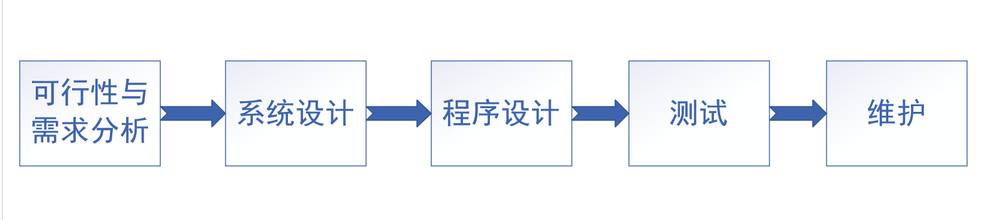
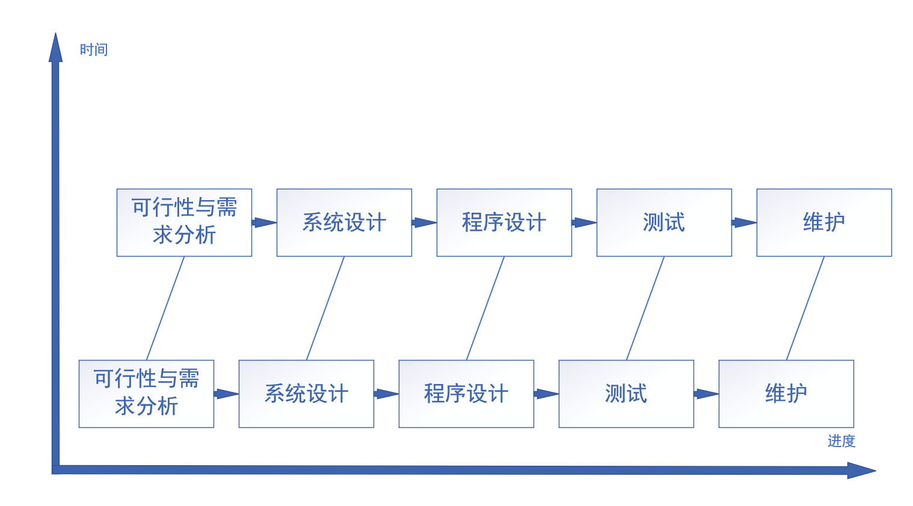
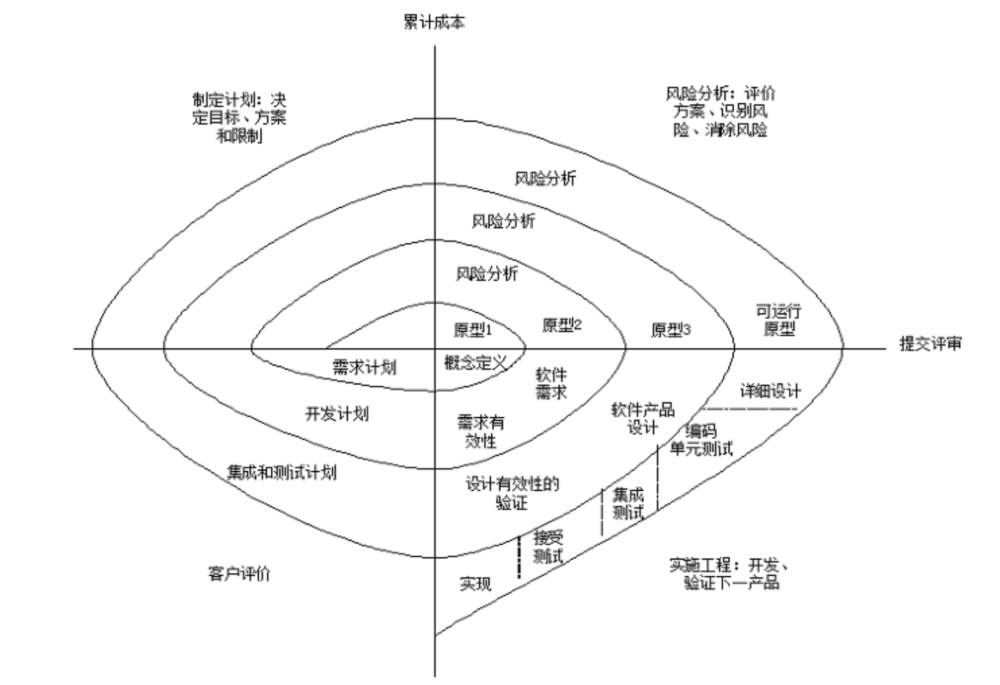
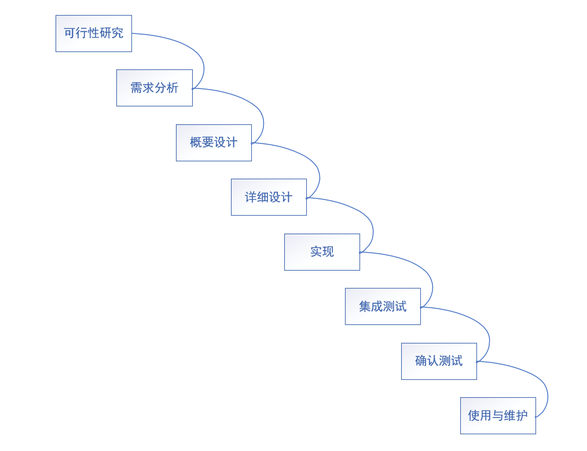
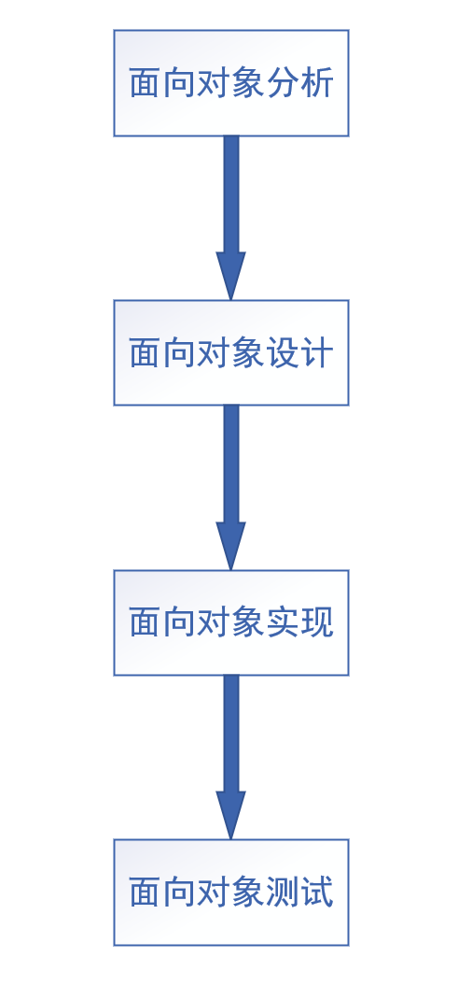

# 软件工程

### 1. 软件工程导论

#### 1.1 软件简介

##### 1. 前提

- 开发软件不等于编写程序
- 错误做法会导致软件危机

##### 2. 计算机软件的发展

- 第一代软件（1946 - 1953），用机器语言编写
- 第二代软件（1954 - 1964），用高级程序设计语言编写
- 第三代软件（1965 - 1970），操作系统出现
- 第四代软件（1971 - 1989），多媒体计算机出现
- 第五代软件（1990 - ），Microsoft占据主导，面向对象编程，万维网普及

##### 3. 软件的分类，特点，特性

- 分类：可按软件规模，工作方式，应用功能，服务对象的范围，使用频率和失效影响划分
- 特点：抽象性，复制简单，不存在老化及磨损，对计算机存在不同程度的依赖性，软件产品大多是定做，复杂，昂贵，涉及社会因素
- 特性：功能性，可靠性，易用性，效率性，可维护性，软件可移植性

#### 1.2 软件工程的产生

##### 1. 软件危机的故事

- 指落后的软件生产方式无法满足迅速增长的计算机软件需求而导致软件开发与维护过程中出现一系列严重问题的现象

##### 2. 软件工程的出现

- 1968，1969年连续召开两次著名的NATO（北大西洋公约组织），提出软件工程的概念

#### 1.3 软件开发工程化和生存周期

##### 1. 计算机软件生存期

1. 计划（Planning）
2. 需求分析（Requirement Analysis）
3. 软件设计（Software Design）
4. 程序编写（Coding Programming）
5. 测试（Testing）
6. 运行和维护（Run and Maintenance）

#### 1.4 软件项目的开发模型

##### 1. 传统软件工程开发模型

- 线性模型：

  

- 渐增式模型：

  

- 螺线模型：

  

- 瀑布模型：

  

##### 2. 面向对象软件工程开发模型

#### 1.5 结构化方法和面向对象方法

